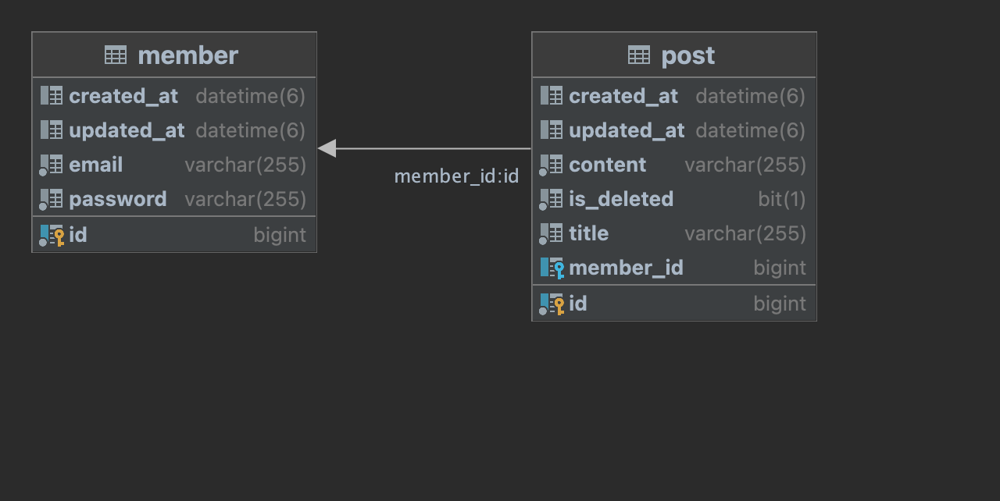

# wanted-pre-onboarding-backend

## 지원자
- 유건
---
## 실행 방법

---
## ERD

- Member(사용자)와 Post(게시글)의 관계를 1:N 관계로 설정

---
## API 데모 영상

---
## API 데모 영상

---
## REST DOCS 기반 API 명세서

- [사용자 API 명세서](https://github.com/youKeon/wanted-pre-onboarding-backend/blob/main/src/main/resources/static/docs/member.html)
- [게시글 API 명세서](https://github.com/youKeon/wanted-pre-onboarding-backend/blob/main/src/main/resources/static/docs/post..html)
